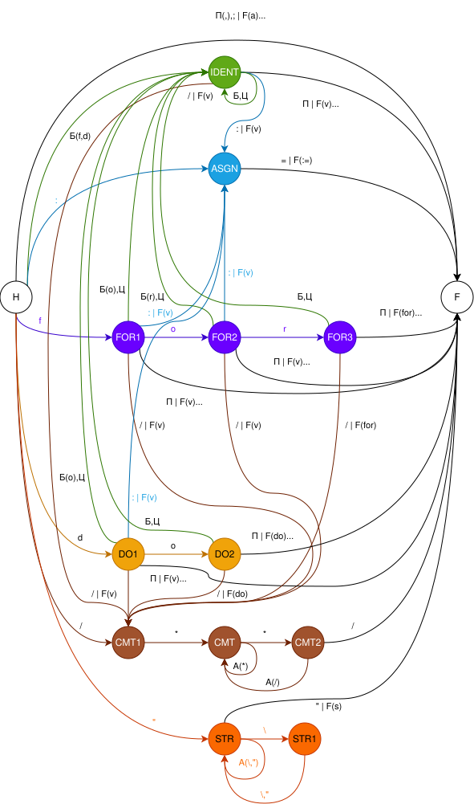

# Лабораторная работа №5. Проектирование лексического анализатора

**Цель работы:** изучение основных понятий теории регулярных грамматик, ознакомление с назначением и принципами работы лексических анализаторов (сканеров), получение практических навыков построения сканера на примере заданного простейшего входного языка.

## Требования к выполнению работы

Для выполнения лабораторной работы требуется написать программу, которая выполняет лексический анализ входного текста в соответствии с заданием и порождает таблицу лексем с указанием их типов и значений. Текст на входном языке задается в виде символьного (текстового) файла. Программа должна выдавать сообщения о наличии во входном тексте ошибок, которые могут быть обнаружены на этапе лексического анализа с указанием места ошибки в исходном тексте программы.

Длину идентификаторов и строковых констант можно считать ограниченной 32 символами. Программа должна допускать наличие комментариев неограниченной длины во входном файле. Форму организации комментариев предлагается выбрать самостоятельно и указать при оформлении отчета.

## Вариант

**Вариант 16.** Входной язык содержит операторы цикла типа `for (…; …; …) do`, разделенные символом `;` (точка с запятой). Операторы цикла содержат идентификаторы, знаки сравнения `<`, `>`, `=`, строковые константы (последовательность символов в двойных кавычках), знак присваивания (`:=`).

## Грамматика языка

Ниже представлена контекстно-связанная грамматика указанного языка в форме Бэкуса-Наура (BNF).

```
<for_loop> ::= "for" "(" <expression> ";" <expression> ";" <expression> ")" "do"
<expression> ::= <identifier> | <expression> <comparison_operator> <expression> | <string_const> | <identifier> <assignment_operator> <expression>
<identifier> ::= <letter> | <letter> <identifier_characters> | "_" <identifier_characters>
<identifier_characters> ::= <identifier_character> | <identifier_character> <identifier_characters>
<identifier_character> ::= <letter> | <digit> | "_"
<string_const> ::= '"' <text> '"'
<text> ::= "" | <character> <text>
<character> ::= <letter> | <digit> | <symbol>
<letter> ::= "A" | "B" | "C" | "D" | "E" | "F" | "G" | "H" | "I" | "J" | "K" | "L" | "M" | "N" | "O" | "P" | "Q" | "R" | "S" | "T" | "U" | "V" | "W" | "X" | "Y" | "Z" | "a" | "b" | "c" | "d" | "e" | "f" | "g" | "h" | "i" | "j" | "k" | "l" | "m" | "n" | "o" | "p" | "q" | "r" | "s" | "t" | "u" | "v" | "w" | "x" | "y" | "z"
<digit> ::= "0" | "1" | "2" | "3" | "4" | "5" | "6" | "7" | "8" | "9"
<symbol> ::= "|" | " " | "!" | "#" | "$" | "%" | "&" | "(" | ")" | "*" | "+" | "," | "-" | "." | "/" | ":" | ";" | ">" | "=" | "<" | "?" | "@" | "[" | "\\\\" | "]" | "^" | "_" | "`" | "{" | "}" | "~" | "'" | '\"' | "\n" | "\r" | "\t"
<assignment_operator> ::= ":="
<comparison_operator> ::= "=" | "<" | ">"
<comment> ::= "/*" <text> "*/"
```

## Конечный автомат

Ниже показан граф переходов конечного автомата, реализованного в программе.

